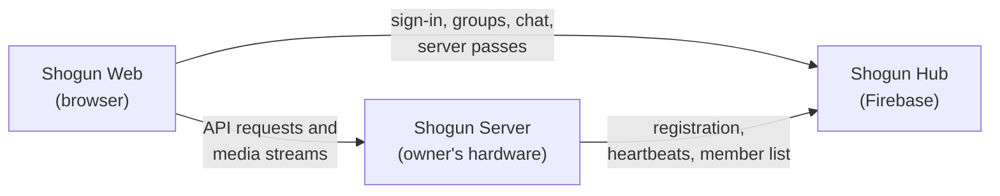

# Shogun

Shogun is a self-hosted media streaming platform. Owners run a **Shogun Server** on their own hardware to organize and stream their personal movie, TV, and music libraries, then invite a small group of friends and family to watch and listen with them. Accounts, groups, and chat are handled by a shared cloud service, while media always streams directly from the owner's server to the viewer.

> **Status:** early development. The server's data layer is in place; most features below are planned and not yet implemented.

---

## Features

- ~~**Personal media libraries:** movies, TV shows, and music, served from the owner's own storage~~
- ~~**Automatic metadata:** titles, artwork, and details matched from TMDB and MusicBrainz~~
- ~~**Direct play and transcoding:** files play as-is when the device supports them, with hardware-accelerated transcoding (via ffmpeg) when it doesn't~~
- ~~**Private groups:** owners invite members and control what each member can access~~
- ~~**Real-time social features:** group chat and live server status~~
- ~~**Mobile-first web app:** one app that works in desktop, tablet, and phone browsers~~

## Architecture

Shogun is made up of three components:

| Component         | Responsibility                                                                  | Technology                                                 |
| ----------------- | ------------------------------------------------------------------------------- | ---------------------------------------------------------- |
| **Shogun Hub**    | Accounts, groups, invites, server directory, server status, chat, notifications | Firebase (Auth, Cloud Firestore, Cloud Functions, Hosting) |
| **Shogun Server** | Libraries, scanning, metadata, streaming, watch progress, member permissions    | C#, ASP.NET Core, Entity Framework Core, SQLite, ffmpeg    |
| **Shogun Web**    | The primary client application                                                  | TypeScript, React, Vite                                    |



Key design principles:

- **Media never passes through the Hub.** Video, audio, and library data travel directly between a Server and the client.
- **Servers never see user credentials.** Firebase Auth manages sign-in; clients present a short-lived, server-specific pass signed by the Hub, which the Server verifies before granting access.
- **Servers stay usable offline.** Each Server keeps a local copy of its member list and permissions, so it continues working if the Hub is unreachable.

Native mobile and TV apps are planned for the future and will live in separate repositories, using the same Hub and Server APIs.

## Repository Structure

This is a monorepo containing the server, cloud functions, and web client.

```text
shogun/
├── backend/
│   ├── Shogun.slnx            # Solution: every .NET project below
│   ├── Makefile               # Shortcuts for build, run, migrations
│   └── Shogun.Server/         # Shogun Server (ASP.NET Core Web API)
│       ├── Controllers/       # HTTP endpoints
│       ├── Data/              # EF Core DbContext and entity configurations
│       ├── Migrations/        # EF Core database migrations
│       └── Models/            # Domain entities (movies, TV, music)
├── docs/roadmap/              # Phase-by-phase build plan
├── firebase/                  # Shogun Hub: Cloud Functions and security rules (planned)
├── web/                       # Shogun Web: React + Vite client (planned)
├── shared/                    # Shared schemas and TypeScript types (planned)
└── pnpm-workspace.yaml        # Ties firebase/, web/, and shared/ together
```

## Getting Started

### Prerequisites

- [.NET 10 SDK](https://dotnet.microsoft.com/download/dotnet/10.0)
- The Entity Framework Core CLI:

    ```bash
    dotnet tool install --global dotnet-ef
    ```

- `make` (optional, for the convenience commands below)

### Running the Server

From `backend/`:

```bash
# Restore packages and build every project in the solution
dotnet build

# Create the local SQLite database from the migrations
dotnet ef database update --project Shogun.Server

# Start the server
dotnet run --project Shogun.Server
```

The API listens on `http://localhost:5265` by default. In the Development environment, interactive API documentation is available at `http://localhost:5265/swagger`.

### Development Commands

A Makefile in `backend/` wraps common tasks:

| Command                             | Description                                |
| ----------------------------------- | ------------------------------------------ |
| `make`                              | Run the server                             |
| `make build`                        | Build every project in the solution        |
| `make test`                         | Run the tests                              |
| `make migrate NAME=<MigrationName>` | Create a new EF Core migration             |
| `make db-update`                    | Apply migrations to the local database     |
| `make jwt-create NAME=<username>`   | Create a development JWT for local testing |
| `make jwt-list`                     | List development JWTs                      |
| `make jwt-list-user ID=<token-id>`  | Show the details of a development JWT      |

### Configuration

Server settings are read from `appsettings.json`, then overridden by [.NET user secrets](https://learn.microsoft.com/en-us/aspnet/core/security/app-secrets) in development and environment variables in production. **Secrets must never be committed to the repository.** `appsettings.Development.json` and local database files are excluded by `.gitignore`.

## Tech Stack

| Area             | Technologies                                                                   |
| ---------------- | ------------------------------------------------------------------------------ |
| Server           | C#, .NET 10, ASP.NET Core, Entity Framework Core, SQLite                       |
| Media processing | ffmpeg (with Intel Quick Sync hardware acceleration)                           |
| Cloud            | Firebase Auth, Cloud Firestore, Cloud Functions (TypeScript), Firebase Hosting |
| Web client       | TypeScript, React, Vite                                                        |

## License

Shogun is licensed under the [Apache License 2.0](LICENSE). See [NOTICE](NOTICE) for attribution.
